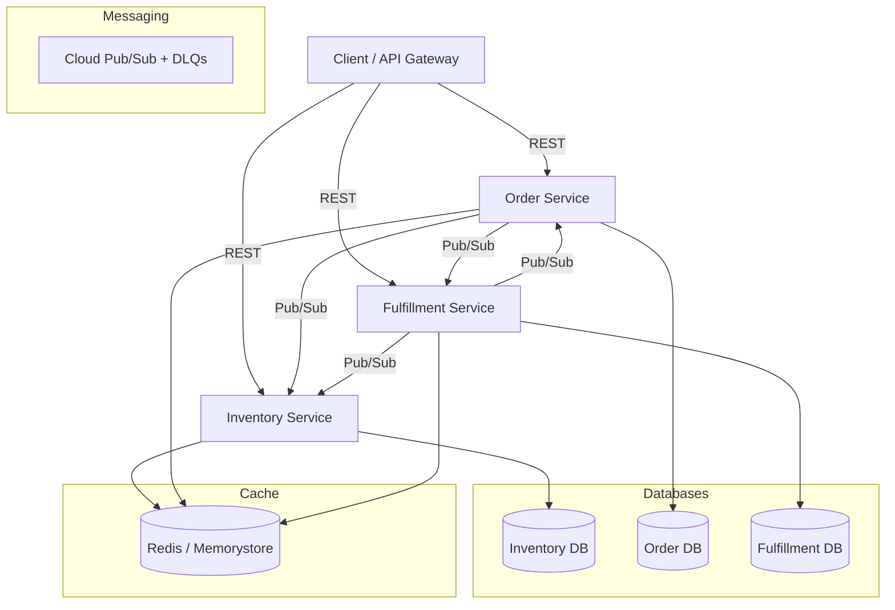
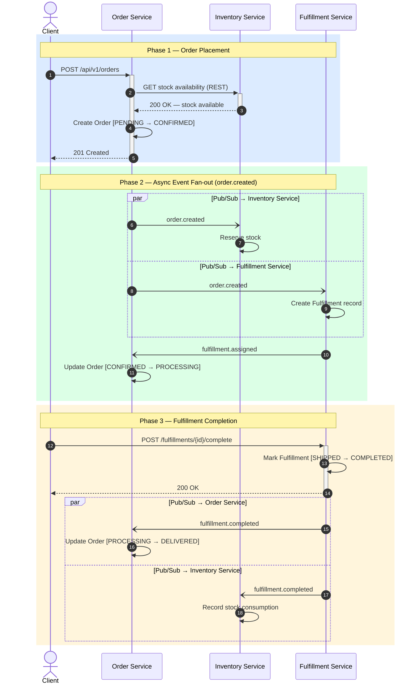

# Supply Chain Microservices

> A production-grade, cloud-native supply chain management system built with Python microservices on Google Cloud Platform.

---

## Table of Contents

1. [Project Overview](#project-overview)
2. [Architecture](#architecture)
3. [Event Flow](#event-flow)
4. [Tech Stack](#tech-stack)
5. [Project Structure](#project-structure)
6. [API Reference](#api-reference)
7. [Getting Started — Local Development](#getting-started--local-development)
8. [Running Tests](#running-tests)
9. [GCP Deployment](#gcp-deployment)
10. [Design Decisions](#design-decisions)
11. [Milestone Progress](#milestone-progress)

---

## Project Overview

SupplyChainForge demonstrates a complete backend system for managing inventory, orders, and fulfillment in a high-scale supply chain environment.

The system consists of three independent microservices that communicate asynchronously, ensuring loose coupling, scalability, and maintainability.

**Core Domains**:
- **Inventory**: Product catalog, stock management, and reservations
- **Orders**: Order lifecycle management with inventory validation
- **Fulfillment**: Warehouse operations, assignment, and shipping workflows

---

## Architecture



---

## Event Flow



---

## Tech Stack

| Layer              | Technology                          | Purpose |
|--------------------|-------------------------------------|-------|
| Language           | Python 3.11+                        | Core development |
| Framework          | FastAPI                             | High-performance APIs |
| ORM                | SQLAlchemy 2.0 (async) + Alembic    | Database operations & migrations |
| Database           | MySQL 8 (Cloud SQL)                 | Relational storage |
| Cache              | Redis (Memorystore)                 | Performance & rate limiting |
| Messaging          | Google Cloud Pub/Sub                | Event-driven architecture |
| Containerization   | Docker (multi-stage)                | Consistent deployments |
| Cloud Platform     | Google Cloud Platform (GCP)         | Hosting & managed services |
| IaC                | Terraform                           | Infrastructure provisioning |
| Testing            | pytest + pytest-asyncio             | Unit, integration & E2E tests |
| Others             | Pydantic, httpx, structlog          | Validation, HTTP, logging |

---

## Project Structure

```
supplychainforge/
├── services/
│   ├── inventory/          # Product & stock management
│   ├── order/              # Order lifecycle
│   └── fulfillment/        # Warehouse & shipping operations
├── shared/                 # Common libraries (events, pubsub, utils)
├── terraform/              # Infrastructure as Code
├── tests/
│   └── e2e/                # End-to-end tests
├── docker-compose.yml
├── cloudbuild.yaml
├── .env.example
└── README.md
```

Each service follows a clean layered architecture (`routers → services → repositories → models`).

---

## API Reference

Each service exposes interactive Swagger documentation at `/docs`.

### Inventory Service (`:8001`)

- Product CRUD operations
- Stock reservation & release (with pessimistic locking)
- Low stock queries


---

### Order Service (`:8002`)

- Order creation with inventory validation
- Order lifecycle management (`PENDING → CONFIRMED → PROCESSING → DELIVERED`)
- Cancellation support


---

### Fulfillment Service (`:8003`)

- Fulfillment creation on order events
- Picking, shipping, and completion workflows
- Status tracking


---

## Getting Started — Local Development

### Prerequisites
- Docker Desktop (recommended)
- Python 3.11+ (for running tests)

### Setup

```bash
git clone <your-repo-url>
cd supplychainforge

cp .env.example .env
docker compose up --build -d
```

### Run Migrations

```bash
for svc in inventory order fulfillment; do
  docker compose exec $svc alembic upgrade head
done
```

### Test the Full Flow
See `tests/e2e/test_e2e_flow.py` or use the example curl commands in the detailed guide.

---

## Running Tests

```bash
# Run all tests (uses in-memory SQLite)
python -m pytest services/ -q --asyncio-mode=auto
```

**Total**: 74 passing tests (unit + integration + E2E).

---

## GCP Deployment

The entire infrastructure is provisioned using **Terraform** (see `/terraform` folder).

**Key GCP Services Used**:
- Cloud Run (serverless containers)
- Cloud SQL (MySQL)
- Memorystore for Redis
- Cloud Pub/Sub + Dead Letter Queues
- Artifact Registry
- Cloud Build (CI/CD)
- Secret Manager + Cloud Monitoring

Full deployment instructions are available in `PRODUCTION_GUIDE.md`.

---

## Design Decisions

- **Database-per-Service** pattern for loose coupling
- **Event-driven communication** using Pub/Sub for async workflows
- **Idempotent consumers** to handle duplicate events safely
- **Pessimistic locking** (`SELECT FOR UPDATE`) for inventory reservations
- **Multi-stage Docker builds** for small, secure images
- **Structured logging** compatible with Cloud Logging
- **Health checks** (liveness + readiness) for Cloud Run
- **Terraform IaC** for reproducible environments

---

## Milestone Progress

| Milestone | Description | Status |
|---------|-----------|--------|
| 1 | Project Setup + Inventory Service | ✅ Complete |
| 2 | Database Layer (SQLAlchemy + Alembic) | ✅ Complete |
| 3 | Event-Driven Architecture (Pub/Sub) | ✅ Complete |
| 4 | Caching + Optimization | ✅ Complete |
| 5 | Order + Fulfillment Services + Integration | ✅ Complete |
| 6 | GCP Deployment + Production Features | ✅ Complete |

---

**This project showcases modern backend engineering practices** including microservices, event-driven design, cloud-native deployment, and production-grade reliability.

Ready for demonstration or extension.
